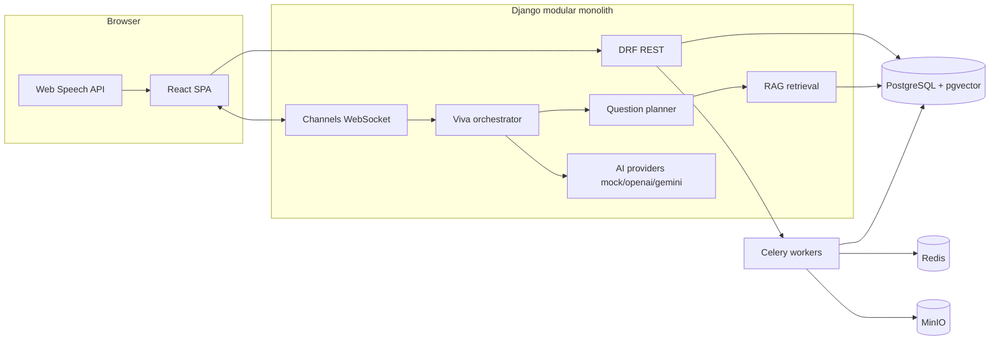

# AI Viva

**Assess understanding, not AI usage.**

AI Viva is a multi-tenant SaaS platform for educational assessment. Instructors define assignments, rubrics, and learning outcomes; students submit work; the system conducts an adaptive oral or text **viva** grounded in that submission and produces an **evidence-backed, AI-generated assessment** for **instructor review**—not automatic grading.

## Product positioning

Generative AI makes it harder to know whether a student truly understands work submitted under their name. AI detectors try to infer whether content was AI-generated. **AI Viva takes a different path:** it asks the student to explain and defend their submission, retrieves evidence from their artifacts, and surfaces structured assessment data for a human instructor to approve or modify.

- The system **does not** claim to detect AI usage or replace academic judgment.
- AI outputs are labeled as **AI-generated assessment evidence**; instructors retain final authority ([Human-in-the-Loop](docs/adr/ADR-008-human-in-the-loop-assessment.md)).
- Default AI mode is **mock** (`AI_PROVIDER=mock`) so local development and demos do not require paid API keys.

## Stack

| Layer | Technology |
|--------|------------|
| Backend API | Django + Django REST Framework |
| Real-time viva | Django Channels (WebSocket), Daphne |
| Async jobs | Celery + Redis |
| Database | PostgreSQL 16 + pgvector |
| Object storage | MinIO (S3-compatible, boto3) |
| Frontend | React, Vite, TypeScript, Tailwind CSS, React Router |
| Voice (MVP) | Browser Web Speech API (STT + TTS for examiner questions) |
| Observability | Structured JSON logs, Prometheus, Grafana |

Not used: Next.js, FastAPI.

## Quickstart

**Prerequisites:** Docker and Docker Compose.

```bash
cp .env.example .env
docker compose up
```

| Service | URL |
|---------|-----|
| Frontend | http://localhost:13000 |
| Backend API | http://localhost:18000/api |
| Django admin | http://localhost:18000/admin |
| Postgres (host) | `localhost:15432` |
| Redis (host) | `localhost:16379` |
| MinIO API / console | http://localhost:19000 / http://localhost:19001 |
| Prometheus | http://localhost:19090 |
| Grafana | http://localhost:13001 (admin / admin) |

Host ports use a `1xxxx` range so they do not clash with other local stacks. Inside Docker, services still use the normal internal ports (`postgres:5432`, `redis:6379`, etc.).

**Frontend UI changes:** The frontend container serves a **static build** baked into the Docker image (unlike the backend, which mounts `./backend` live). After changing React code, rebuild and restart:

```bash
docker compose build frontend && docker compose up -d frontend
```

**Backend API changes:** The backend mounts `./backend` live, but **Daphne does not auto-reload**. After adding or changing API endpoints, restart:

```bash
docker compose restart backend
```

Or hard-refresh the browser (`Cmd+Shift+R`) after rebuilding. Use the **student viva URL** `http://localhost:13000/student/viva/<session-id>` — not `/viva-sessions/:id` (that page is instructor review only).

Health check: `GET http://localhost:18000/api/health/`

On first start, the backend runs migrations and ensures the MinIO bucket exists.

Debug logs: `docker compose logs -f backend` and `docker compose logs -f celery-worker`.

### Demo data

```bash
docker compose exec backend python manage.py seed_demo_data
```

| Role | Email | Password |
|------|-------|----------|
| Org admin | `admin@northbridge.edu` | `DemoPass123!` |
| Instructor | `instructor@northbridge.edu` | `DemoPass123!` |
| Student | `alex.morgan@student.northbridge.edu` | `DemoPass123!` |
| Student | `jordan.lee@student.northbridge.edu` | `DemoPass123!` |
| Student | `riley.patel@student.northbridge.edu` | `DemoPass123!` |

After login, set the active organization from the returned memberships (the SPA stores `X-Organization-ID`).

## Architecture (summary)



Core workflow: **assignment → submission processing → knowledge/RAG → question plan → live viva → answer evaluation → assessment → instructor HITL review**.

Details: [docs/architecture.md](docs/architecture.md), [docs/development-plan.md](docs/development-plan.md), [docs/implementation-status.md](docs/implementation-status.md).

## Repository layout

```text
backend/     Django apps (accounts, orgs, courses, assignments, …)
frontend/    React Vite SPA
docs/        PRD, SRS, architecture, ADRs, runbooks
infra/       Prometheus / Grafana provisioning
docker-compose.yml
```

## Documentation

- [Product requirements (PRD)](docs/PRD.md)
- [Software requirements (SRS)](docs/SRS.md)
- [API overview](docs/api.md)
- [Interview guide](docs/interview-guide.md)
- [Final architecture review](docs/final-architecture-review.md)
- [Implementation status](docs/implementation-status.md)
- [AI evaluation](docs/ai-evaluation.md)
- [Contributing](CONTRIBUTING.md)
- [Architecture decision records](docs/adr/)

## Local verification (without Docker)

```bash
# Backend
cd backend && python -m venv .venv && source .venv/bin/activate
pip install -r requirements.txt
pytest -q
python ../scripts/eval/run_eval.py

# Frontend
cd frontend && npm ci && npm run build
```

Full stack still requires Docker for Postgres, Redis, MinIO, and Celery.

## License

MIT — see [LICENSE](LICENSE).
