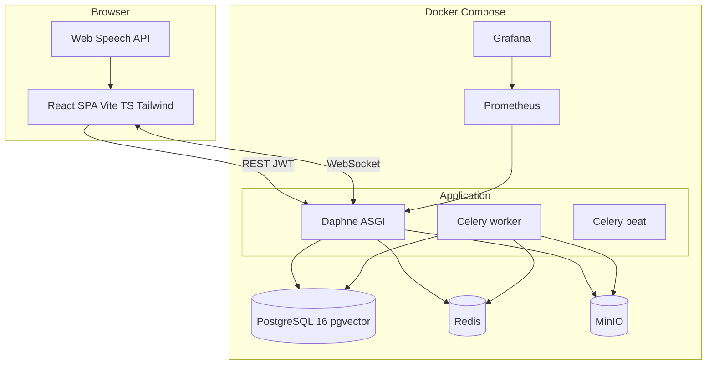
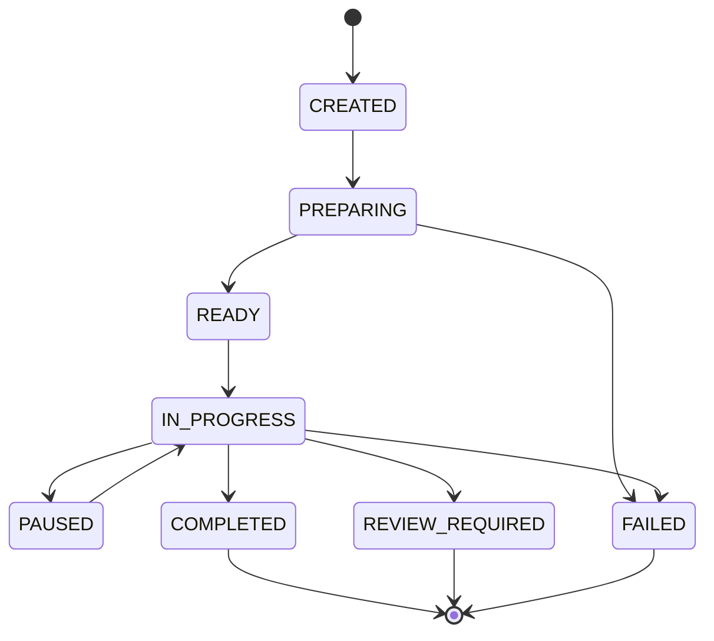
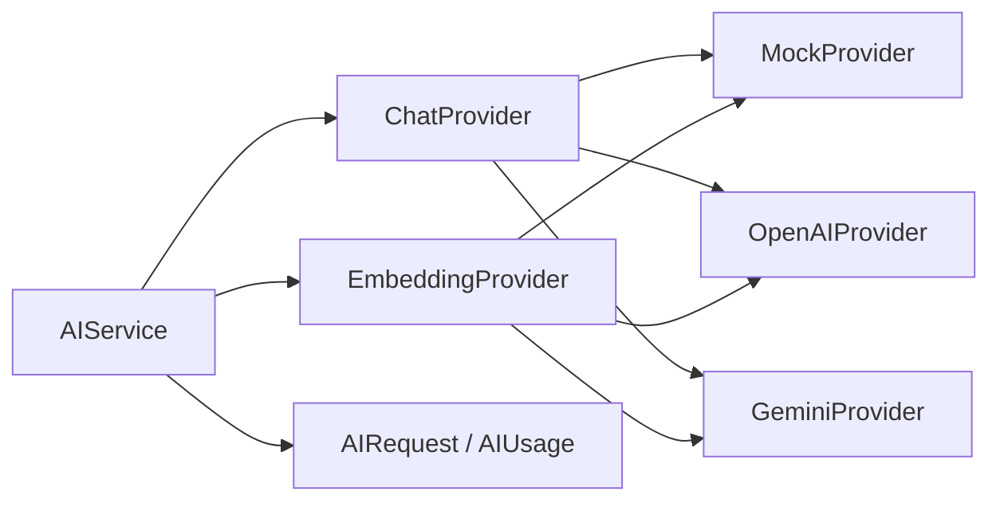

# Architecture — AI Viva

## 1. Style

**Modular monolith** (ADR-001): one deployable Django application with clear app boundaries (`accounts`, `orgs`, `viva`, …), one PostgreSQL database, horizontal scaling via multiple web/worker processes—not microservices for MVP.

## 2. High-level system

## 3. Backend layers

| Layer | Responsibility |
|-------|----------------|
| **DRF views/serializers** | HTTP API, auth, validation, pagination |
| **Permissions / mixins** | RBAC, organization scoping |
| **Services** | Viva orchestration, question planning, RAG, AI calls |
| **Models** | Persistence, state machines, audit fields |
| **Celery tasks** | Extraction, embeddings, long-running pipelines |
| **Channels consumers** | Live viva WebSocket protocol |

Entry: `config.asgi` (HTTP + WebSocket), `config.wsgi` (optional), `config.celery`.

## 4. Core runtime flows

### 4.1 Submission processing

See [submission-processing.md](submission-processing.md). Upload via API → MinIO → `Submission` record → Celery chain → chunks + embeddings → `READY`.

### 4.2 Viva session

Orchestrator persists `VivaSession.state`, `understanding_state`, `coverage_state` on each transition. WebSocket pushes UI updates (question, timer, connection status).

### 4.3 Assessment HITL

AI generates `Assessment` in `draft` / `pending_review` → instructor inspects evidence → `AssessmentModification` records changes → `finalized` only after instructor action.

## 5. AI architecture

Selection via `AI_PROVIDER` env (`mock` | `openai` | `gemini`). STT/TTS provider interfaces exist for future server-side voice; MVP uses browser APIs ([voice.md](voice.md)).

## 6. RAG

Retrieval over `SubmissionChunk` (+ assignment/rubric text) using pgvector similarity, filtered by `organization_id` and `submission_id`. Citations use `source_ref` and chunk metadata ([rag.md](rag.md), ADR-009).

## 7. Frontend

SPA with React Router. Instructor and student route trees under `/` and `/student/*`. API client uses `VITE_API_URL`; WebSocket uses `VITE_WS_URL`. No Next.js server components.

## 8. Observability

- JSON structured logs (`common.logging.JSONFormatter`)
- `django-prometheus` at `/metrics`
- Compose includes Prometheus + Grafana ([observability.md](observability.md))

## 9. Security overview

Tenant isolation at queryset level, JWT auth, throttling, soft deletes, audit log. Threat model: [threat-model.md](threat-model.md).

## 10. Deployment

Single-compose local dev; production patterns in [deployment.md](deployment.md) and [scaling.md](scaling.md).

## Related documents

- [database.md](database.md) — ER and tables
- [docs/adr/](adr/) — decision records
- [design-decisions.md](design-decisions.md) — summary index
