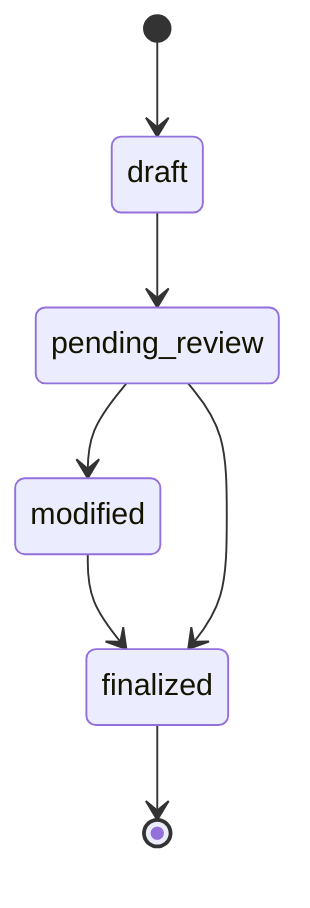

# Assessment Engine

Generates `Assessment` and related rows after viva completion (or when entering `REVIEW_REQUIRED`).

## Outputs

- `Assessment` with strengths, weaknesses, evidence summary, areas requiring review
- `AssessmentCriterion` per rubric dimension (AI scores + explanations)
- `AssessmentEvidence` linking criteria to `StudentAnswer` quotes and submission `source_ref`
- Disclaimer string on every assessment record

## Status workflow

Only instructors (or org admins) may reach `finalized`.

## HITL modifications

`AssessmentModification` captures field-level changes when instructors adjust scores or notes. Original AI values remain on `ai_score` / `ai_overall_score`.

## Generation inputs

- Full viva transcript (questions, answers, evaluations)
- Rubric weights
- Aggregated understanding state
- Retrieval-backed evidence per criterion

## Related

- [ADR-008](adr/ADR-008-human-in-the-loop-assessment.md)
- [answer-evaluation.md](answer-evaluation.md)
