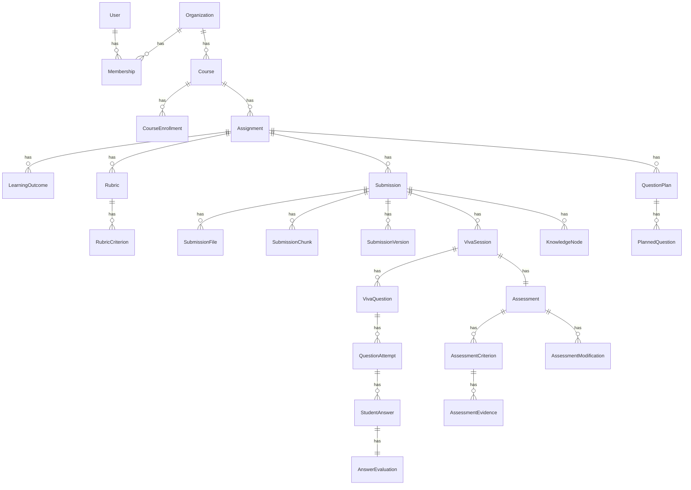

# Database Design — AI Viva

**Engine:** PostgreSQL 16 with **pgvector** extension (Docker image `pgvector/pgvector:pg16`).

**Conventions:** UUID primary keys, `created_at` / `updated_at`, soft delete (`is_deleted`, `deleted_at`) on domain models via `common.SoftDeleteModel`.

## Entity relationship (core)

## Tenant boundary

`Organization` is the tenant root. Derived scopes:

- `Course.organization_id`
- `Assignment` → `course.organization_id`
- `Submission`, `VivaSession`, `Assessment` expose `organization_id` via assignment/course chain

All list/retrieve querysets must filter by the caller’s organization membership.

## Key tables

### Identity & access

| Model | App | Notes |
|-------|-----|--------|
| `User` | accounts | Email login; extends `AbstractUser` + UUID + soft delete |
| `Organization` | orgs | `slug` unique |
| `Membership` | orgs | `role`: organization_admin, instructor, student, viewer |

### Instructional

| Model | App | Notes |
|-------|-----|--------|
| `Course` | courses | Belongs to organization |
| `CourseEnrollment` | courses | Student/instructor enrollment role |
| `Assignment` | assignments | Status lifecycle |
| `LearningOutcome` | assignments | LO codes linked to assignment |
| `Rubric` / `RubricCriterion` | rubrics | Weights and max scores |

### Submissions

| Model | App | Notes |
|-------|-----|--------|
| `Submission` | submissions | Status: uploaded → queued → processing → ready/failed |
| `SubmissionFile` | submissions | `storage_key` in MinIO |
| `SubmissionChunk` | submissions | Text + metadata; `embedding` (pgvector or JSON fallback) |
| `SubmissionVersion` | submissions | Version snapshots |

### Intelligence

| Model | App | Notes |
|-------|-----|--------|
| `KnowledgeNode` | rag | Typed nodes (problem, methodology, …) |
| `RetrievalLog` | rag | Query audit for RAG |
| `QuestionPlan` / `PlannedQuestion` | questions | Planner output before viva |

### Viva

| Model | App | Notes |
|-------|-----|--------|
| `VivaSession` | viva | State machine, `understanding_state`, `coverage_state` JSON |
| `VivaQuestion` | viva | `provenance` JSON, link to `PlannedQuestion` |
| `QuestionAttempt` | viva | Retries per question |
| `StudentAnswer` | viva | Text transcript; optional `audio_storage_key` |
| `AnswerEvaluation` | viva | Scores + `evidence_refs` |

### Assessment

| Model | App | Notes |
|-------|-----|--------|
| `Assessment` | assessments | Status through finalized; AI vs instructor scores |
| `AssessmentCriterion` | assessments | Per-rubric dimension |
| `AssessmentEvidence` | assessments | Links answers and submission quotes |
| `AssessmentModification` | assessments | HITL audit trail |

### AI & audit

| Model | App | Notes |
|-------|-----|--------|
| `AIModel` | ai | Registry metadata |
| `AIRequest` | ai | Per-call tokens, cost, latency |
| `AIUsage` | ai | Aggregated usage |
| `AuditLog` | audit | Sensitive actions |

## Indexes

Defined on models where high-volume filters apply (e.g. `Submission` by assignment/student/status, `VivaSession` by student/state). Additional pgvector indexes (IVFFlat/HNSW) to be added when embedding volume warrants (Phase 4).

## Migrations

Run via `python manage.py migrate` on backend startup in Docker Compose.

## Vector storage

Target: `pgvector` `VectorField` on `SubmissionChunk.embedding` with dimension aligned to `EMBEDDING_DIMENSIONS` (default 1536 in settings). Current scaffold may use JSONField until pgvector field migration lands in Phase 4.

## Soft delete

Default managers exclude `is_deleted=True`. Use `all_objects` for admin/recovery only.
