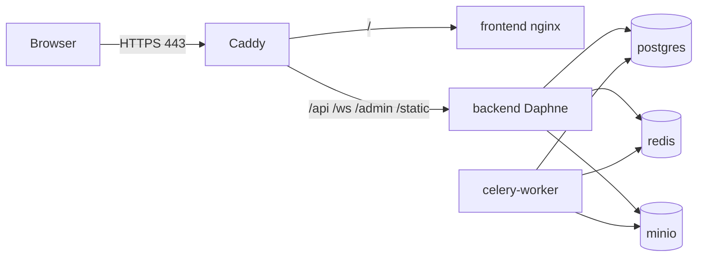

# Deployment

## Local (default)

```bash
cp .env.example .env
docker compose up --build
```

Services: frontend (13000), backend (18000), postgres, redis, minio, celery-worker, celery-beat, prometheus, grafana.

## Production on Linode (`mokhik.online`)

Single-VPS layout: Caddy terminates TLS and reverse-proxies to the SPA + Django. Postgres, Redis, and MinIO stay on the private Docker network (no public ports).



### 1. Linode server

1. Create a Nanode / Shared CPU (2 GB RAM minimum; 4 GB recommended with AI + MinIO).
2. Image: Ubuntu 24.04 LTS.
3. Open firewall: **22**, **80**, **443** only (Cloud Firewall or UFW).
4. Note the public IPv4 (and IPv6 if you use it).

```bash
# On the server
sudo apt update && sudo apt install -y docker.io docker-compose-v2 git
sudo usermod -aG docker $USER   # then log out/in
```

### 2. DNS at your domain registrar

Point `mokhik.online` at the Linode IP:

| Type | Name | Value |
|------|------|-------|
| A | `@` | `<LINODE_IPV4>` |
| A | `www` | `<LINODE_IPV4>` |
| AAAA | `@` / `www` | `<LINODE_IPV6>` (optional) |

Wait until `dig +short mokhik.online` returns the Linode IP before starting Caddy (Let's Encrypt needs that).

### 3. Deploy the app

```bash
git clone https://github.com/ritchi-e/VIVA.git mokhik
cd mokhik
cp .env.production.example .env
# Edit .env — set secrets, API keys, Google OAuth IDs
nano .env

docker compose -f docker-compose.prod.yml up -d --build
docker compose -f docker-compose.prod.yml logs -f caddy backend
```

Health checks:

- https://mokhik.online/
- https://mokhik.online/api/health/

Seed demo users (optional):

```bash
docker compose -f docker-compose.prod.yml exec backend python manage.py seed_demo_data
```

### 4. Google OAuth console

In [Google Cloud Console](https://console.cloud.google.com/apis/credentials) → your OAuth client:

- **Authorized JavaScript origins:** `https://mokhik.online`
- **Authorized redirect URIs:** not required for GIS ID-token flow; add if Google asks

`GOOGLE_OAUTH_CLIENT_ID` and `VITE_GOOGLE_CLIENT_ID` must match. Rebuild frontend after changing `VITE_*`:

```bash
docker compose -f docker-compose.prod.yml up -d --build frontend
```

### 5. Environment checklist

| Variable | Production value |
|----------|------------------|
| `DJANGO_DEBUG` | `false` |
| `DJANGO_SECRET_KEY` | long random string |
| `DJANGO_ALLOWED_HOSTS` | `mokhik.online,www.mokhik.online` |
| `DJANGO_CORS_ALLOWED_ORIGINS` | `https://mokhik.online,https://www.mokhik.online` |
| `DJANGO_CSRF_TRUSTED_ORIGINS` | same as CORS |
| `VITE_API_URL` | `https://mokhik.online/api` |
| `VITE_WS_URL` | `wss://mokhik.online/ws` |
| `POSTGRES_PASSWORD` / MinIO keys | strong, unique |
| AI / Deepgram / Rumik keys | from your local `.env` |

Do **not** use `docker-compose.yml` (dev) on the server — it publishes Postgres/Redis/MinIO/Grafana to the public host.

### 6. Updates

```bash
cd mokhik
git pull
docker compose -f docker-compose.prod.yml up -d --build
```

### 7. Backups

- Snapshot the Linode weekly, or
- `docker compose -f docker-compose.prod.yml exec postgres pg_dump -U aiviva aiviva > backup.sql`
- Persist `postgres_data` / `minio_data` volumes

## Production architecture (managed alternative)

For larger scale, move Postgres / Redis / object storage to managed services and keep only API + workers + static frontend on the VPS. See the diagram in earlier docs revisions.
