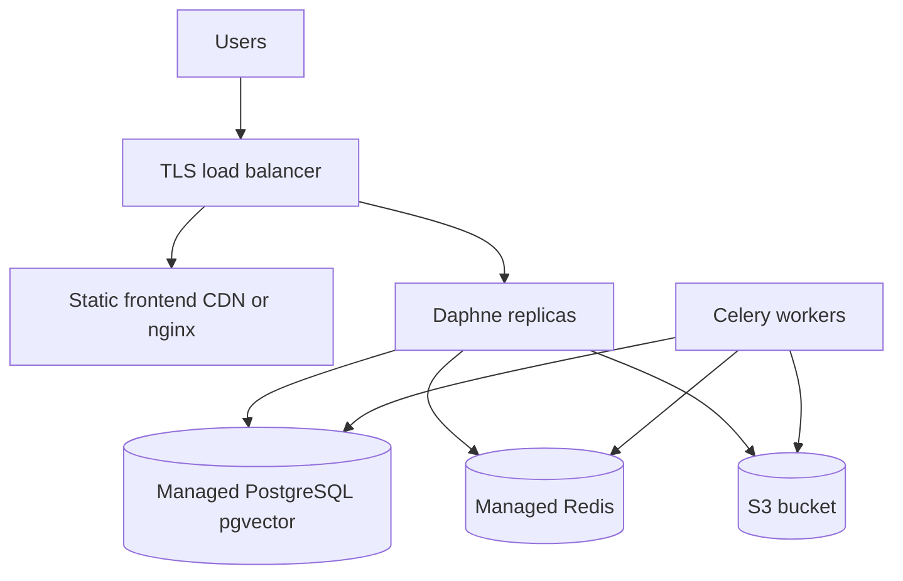

# Deployment

## Local (default)

```bash
cp .env.example .env
docker compose up --build
```

Services: frontend (3000), backend (8000), postgres, redis, minio, celery-worker, celery-beat, prometheus (9090), grafana (3001).

## Production architecture (reference)



## Environment

- Set `DJANGO_DEBUG=false`, strong `DJANGO_SECRET_KEY`, restricted `ALLOWED_HOSTS`
- Real S3 instead of MinIO; remove public MinIO console exposure
- `AI_PROVIDER` and API keys via secret manager
- `DJANGO_CORS_ALLOWED_ORIGINS` for production SPA origin only

## Migrations

Run `python manage.py migrate` on deploy before serving traffic. Compose runs migrate on backend start for dev.

## CI/CD (Phase 12)

GitHub Actions: lint, test, image build. No automatic deploy to paid cloud in MVP.

## Backups

PostgreSQL automated backups; MinIO/S3 versioning for submission objects.
