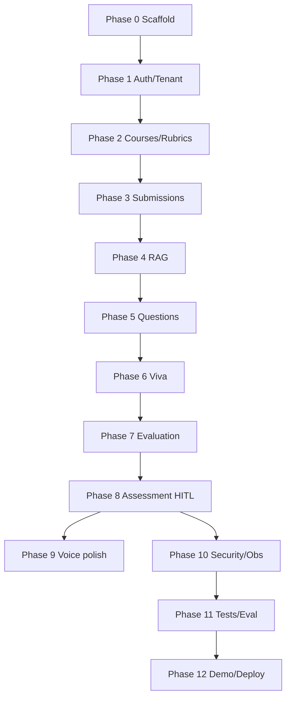

# Development Plan — AI Viva

Depth-first delivery: complete the core assessment loop before breadth (CI, full test matrix, AI eval suite).

## Phases

| Phase | Focus | Status |
|-------|--------|--------|
| **0** | Repo scaffold, Docker Compose, Django + React skeletons, core docs, ADRs, `.env.example`, README | In progress |
| **1** | JWT auth, orgs/memberships, RBAC, tenant isolation, Google OAuth stub, rate limiting, login/register UI | Pending |
| **2** | Courses, assignments, learning outcomes, rubrics CRUD + instructor UI | Pending |
| **3** | Submission upload (MinIO), Celery pipeline, format adapters, chunking | Pending |
| **4** | pgvector embeddings, RAG retrieval, knowledge representation, AI providers | Pending |
| **5** | Question planner + LLM wording + provenance | Pending |
| **6** | Viva orchestrator, WebSocket session, adaptive questioning, text + voice UI | Pending |
| **7** | Structured answer evaluation | Pending |
| **8** | Assessment generation + instructor HITL UI (**MVP demo path complete**) | Pending |
| **9** | Voice UX polish (reconnection, fallback) | Pending |
| **10** | Observability hardening, security, threat model | Pending |
| **11** | Automated tests + AI evaluation framework | Pending |
| **12** | Demo seed, CI/CD, deployment docs, final verification | Pending |

## Phase 0 deliverables

- [x] Monorepo directories: `backend/`, `frontend/`, `docs/`, `infra/`
- [x] `docker-compose.yml` with postgres (pgvector), redis, minio, backend, celery, frontend, prometheus, grafana
- [x] Django project with domain apps and model stubs
- [x] React Vite TypeScript Tailwind skeleton
- [x] `.env.example` with `AI_PROVIDER=mock`
- [x] Root README, CONTRIBUTING, CHANGELOG, LICENSE, `.gitignore`
- [x] `docs/PRD.md`, `SRS.md`, `architecture.md`, `database.md`, topic doc stubs
- [x] ADR-001 through ADR-012
- [ ] All API URL modules wired and smoke-tested end-to-end in compose
- [ ] `implementation-status.md` updated at phase completion

## Dependencies

## Documentation rule

Update [implementation-status.md](implementation-status.md) after each phase milestone. Keep diagrams in [architecture.md](architecture.md) aligned with code.

## Locked decisions

- Mock AI by default; OpenAI/Gemini via env.
- Voice: browser Web Speech API for MVP; backend STT/TTS interfaces reserved.
- Modular monolith (no microservices for MVP).

See [design-decisions.md](design-decisions.md) and [docs/adr/](adr/).
