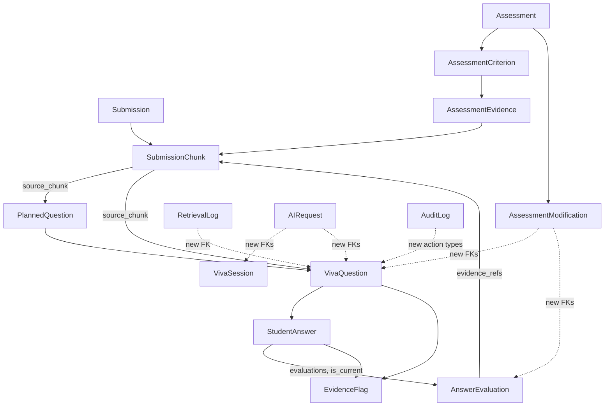

# Evidence, Provenance & Auditability System — Design (Phase 1: Core Provenance)

**Depends on:** [`docs/evidence-system-audit.md`](evidence-system-audit.md) — read that first.

**Scope decision (confirmed with stakeholder):**
- Phase 1 only. In scope: provenance data model, question/answer/evaluation provenance, per-question instructor override, audit trail, evidence dashboard + drill-down, tenant-isolation tests for new surfaces.
- **Deferred to a later phase:** automated contradiction/inconsistency detection logic (model scaffold only, no detection AI in Phase 1), source-viewer highlighting (locator text only, no rendered highlight), exportable appeal/evidence package.
- History strategy: **supersede-with-flag** on `AnswerEvaluation` (new row + `is_current`/`version`), not a separate append-only revision model.

---

## 1. Existing architecture (recap)

Django modular monolith. Relevant chain: `Organization → Course → Assignment → Submission → VivaSession → VivaQuestion → StudentAnswer → AnswerEvaluation`, with `Assessment/AssessmentCriterion/AssessmentEvidence/AssessmentModification` as the post-viva instructor-review layer. RAG: `SubmissionChunk` (has `embedding_vec` via pgvector) is retrieved by `rag/retrieval.py`, logged to `RetrievalLog`, and consumed by `questions/planner.py` and `viva/conversation.py` / `viva/evaluation.py`. AI calls go through `ai/service.py::AIService`, logged to `AIRequest`. Generic audit trail: `audit/models.py::AuditLog` + `audit/services.py::log_audit()`. Tenant isolation: header-driven (`X-Organization-ID`) + `TenantContextMixin`/`TenantQuerysetMixin` (`common/tenancy.py`) + per-viewset `get_queryset()` join-chain filtering.

## 2. Existing reusable components (do not duplicate)

- `SubmissionChunk` → the Evidence object.
- `PlannedQuestion` / `VivaQuestion` → the Question provenance objects.
- `StudentAnswer` / `AnswerEvaluation` → Answer + Evaluation objects.
- `AssessmentEvidence` → per-criterion evidence citation (exists, unused — activate it).
- `AssessmentModification` → override-history object (exists — generalize it).
- `AuditLog` / `log_audit()` → audit trail (exists — extend action vocabulary).
- `AIRequest` / `AIService._log()` → AI telemetry (exists — extend FK coverage + TTS/STT).
- `RetrievalLog` → retrieval trace (exists — add FK to question).
- Frontend: `lib/api.ts` (axios + domain objects), `hooks/useAsync.ts`, `components/ui/*`, `layout/PageHeader.tsx`/`StateViews.tsx`, `VivaSessionDetailPage.tsx`'s citation rendering, `PlagiarismReportPanel.tsx`'s nested-card/flag pattern.

## 3. New/modified models

### 3.1 `submissions` app — evidence location on chunks

`SubmissionChunk` (extend, migration `submissions/migrations/00XX_chunk_location.py`):

```python
page_number = models.PositiveIntegerField(null=True, blank=True)
section_heading = models.CharField(max_length=255, blank=True)
slide_number = models.PositiveIntegerField(null=True, blank=True)
inner_path = models.CharField(max_length=500, blank=True)  # ZIP inner file path
start_offset = models.PositiveIntegerField(null=True, blank=True)
end_offset = models.PositiveIntegerField(null=True, blank=True)
```

`SubmissionFile` (extend): add `extractor_version = models.CharField(max_length=64, blank=True)`, set from a new `EXTRACTOR_VERSION` constant per adapter (`adapters/{pdf,docx_adapter,pptx_adapter,zip_adapter}.py`).

**Pipeline change** (`submissions/pipeline.py`): rewrite `_chunk_text()`/`_file_chunks()` to be structure-aware:
- PDF: chunk per page (using `SubmissionFile.structure.pages[]`), set `page_number`; sub-chunk long pages with `start_offset`/`end_offset` relative to the page.
- DOCX: chunk per paragraph group, set nearest heading as `section_heading` if the adapter is extended to capture heading styles (stretch — otherwise leave `section_heading` blank and only set paragraph-relative offsets).
- PPTX: chunk per slide, set `slide_number`.
- ZIP: chunk per inner file, set `inner_path` (currently only the outer ZIP name is used — this is the fix).
- GitHub/code path is unaffected (already has `path`/`start_line`/`end_line`).

This directly satisfies Requirement #2's document evidence fields without a new model.

### 3.2 `questions` app — question provenance

`PlannedQuestion` (extend):

```python
retrieval_query = models.TextField(blank=True)
prompt_version = models.CharField(max_length=64, blank=True)
model_name = models.CharField(max_length=128, blank=True)
model_provider = models.CharField(max_length=64, blank=True)
source_chunk = models.ForeignKey("submissions.SubmissionChunk", null=True, blank=True, on_delete=models.SET_NULL, related_name="+")
```

`metadata` JSON is kept as-is for anything not promoted (backward compatible — old rows just have blank new fields, code must not assume they're populated).

### 3.3 `viva` app — asked-question, answer, evaluation provenance

`VivaQuestion` (extend): same five fields as `PlannedQuestion` above (`retrieval_query`, `prompt_version`, `model_name`, `model_provider`, `source_chunk`), populated in `orchestrator.py::_create_question_from_turn()`. `provenance` JSON retained for the full ranked chunk list + rationale text (not worth promoting fully to columns).

`StudentAnswer` (extend):

```python
metadata = models.JSONField(default=dict, blank=True)   # {"asr_model": ..., "asr_provider": ...}
duration_seconds = models.FloatField(null=True, blank=True)
```

`audio_storage_key` field already exists — wire it: when `input_mode == "voice"`, persist the audio blob to MinIO before/at transcription time (`viva/views.py::transcribe`) and store the key + `metadata.asr_model`/`asr_provider` on the eventual `StudentAnswer`. No versioning added here — answers remain create-once/idempotent (already true), which satisfies "do not overwrite" trivially since there is no edit path.

`AnswerEvaluation` (extend — **breaking change, see 3.3.1**):

```python
confidence = models.CharField(max_length=32, choices=[
    ("high", "High confidence"), ("medium", "Medium confidence"),
    ("low", "Low confidence"), ("insufficient_evidence", "Insufficient evidence"),
], blank=True)
evidence_quality = models.CharField(max_length=32, choices=[
    ("direct", "Direct submission evidence"), ("derived", "Derived/inferred"),
    ("stated", "Student-stated"), ("external", "External/general knowledge"),
], blank=True)
version = models.PositiveIntegerField(default=1)
is_current = models.BooleanField(default=True)
superseded_at = models.DateTimeField(null=True, blank=True)
```

**3.3.1 Breaking change called out explicitly:** `AnswerEvaluation.answer` is currently `OneToOneField`. To support "supersede with a new row" it must become a `ForeignKey` (`related_name="evaluations"`) with a uniqueness constraint of `(answer, is_current=True)` enforced in the service layer (Postgres partial unique index: `UniqueConstraint(fields=["answer"], condition=Q(is_current=True), name="uniq_current_eval_per_answer")`). Every call site assuming `answer.evaluation` is a single object must change to `answer.evaluations.filter(is_current=True).first()` — add a `StudentAnswer.current_evaluation` property to centralize this. Call sites to update: `viva/evaluation.py` (`update_or_create` → create-new-and-flip), `viva/serializers.py::AnswerEvaluationSerializer` usage, `assessments/engine.py` (reads evaluations to build `AssessmentCriterion`/`AssessmentEvidence`), `frontend/src/pages/VivaSessionDetailPage.tsx` and `frontend/src/types/index.ts::VivaStudentAnswer.evaluation` (now must come from a `current_evaluation` field on the serialized answer, not a nested one-to-one). This is the single riskiest migration in Phase 1 — sequence it first and run the full regression suite immediately after.

### 3.4 `assessments` app — activate `AssessmentEvidence`, generalize overrides

`AssessmentEvidence` — **no schema change**. Populate it in `assessments/engine.py::generate_assessment_for_session()` by pulling `AnswerEvaluation.evidence_refs` → resolving to `SubmissionChunk` → writing `source_ref`/`quote`/`note` per criterion. Render it in `AssessmentReview.tsx` (`evidence_items` is already typed, currently dead).

`AssessmentModification` (extend):

```python
viva_question = models.ForeignKey("viva.VivaQuestion", null=True, blank=True, on_delete=models.SET_NULL)
answer_evaluation = models.ForeignKey("viva.AnswerEvaluation", null=True, blank=True, on_delete=models.SET_NULL)
action = models.CharField(max_length=32, choices=[
    ("agree", "Agree"), ("modify", "Modify"), ("override", "Override"),
    ("insufficient_evidence", "Mark insufficient evidence"),
    ("dismiss_flag", "Dismiss flag"), ("confirm_flag", "Confirm flag"), ("note", "Add note"),
], default="modify")
```

New endpoint `POST /api/assessments/{id}/questions/{question_id}/review/` (new view method on `AssessmentViewSet`) accepting `{action, new_value?, reason?}`, writing an `AssessmentModification` row scoped to that question/evaluation. This is the per-question override the audit identified as missing — it reuses the existing model instead of inventing a parallel one.

### 3.5 `ai` app — telemetry FK coverage

`AIRequest` (extend):

```python
viva_session = models.ForeignKey("viva.VivaSession", null=True, blank=True, on_delete=models.SET_NULL)
viva_question = models.ForeignKey("viva.VivaQuestion", null=True, blank=True, on_delete=models.SET_NULL)
submission = models.ForeignKey("submissions.Submission", null=True, blank=True, on_delete=models.SET_NULL)
```

Route TTS (`ai/providers/{rumik,openai}_provider.py` calls in `viva/views.py::speak`) and STT (`deepgram_provider.py` call in `viva/views.py::transcribe`) through `AIService._log()` (extract the logging call into a reusable helper if `AIService` isn't a natural fit for TTS/STT's byte-stream interface — the point is every provider call gets an `AIRequest` row).

### 3.6 `rag` app — link retrieval to question

`RetrievalLog` (extend): `viva_question = models.ForeignKey("viva.VivaQuestion", null=True, blank=True, on_delete=models.SET_NULL)`. Set at the two call sites that already have both the log and the question in scope (`questions/planner.py`, `viva/conversation.py`).

### 3.7 `audit` app — no schema change, new action vocabulary

Add action constants and call `log_audit()` from: submission created/processed (`submissions/serializers.py`, `submissions/pipeline.py`), question generated/asked (`questions/planner.py`, `viva/orchestrator.py`), answer received (`viva/orchestrator.py::submit_answer`), evaluation generated (`viva/evaluation.py`), flag created/resolved (new `evidence` app), instructor review started/changed (`assessments/views.py`), assessment finalized (already logged — verify metadata is rich enough). Thread the existing `X-Request-ID` (set by `common/middleware.py::RequestLoggingMiddleware`) into `AuditLog.metadata.request_id` via a small `threading.local`/contextvar helper in `common/tenancy.py` or a new `common/request_context.py`.

### 3.8 New app: `evidence` (flag scaffold + read-only aggregation)

A new lightweight app for the two genuinely cross-cutting pieces of Phase 1 that don't belong to any single existing app:

**`EvidenceFlag` model:**

```python
class EvidenceFlag(UUIDModel, SoftDeleteModel):
    class FlagType(models.TextChoices):
        INCONSISTENCY = "inconsistency", "Inconsistency"
        INSUFFICIENT_EVIDENCE = "insufficient_evidence", "Insufficient evidence"
        UNSUPPORTED_CLAIM = "unsupported_claim", "Unsupported claim"
        POSSIBLE_MISUNDERSTANDING = "possible_misunderstanding", "Possible misunderstanding"
        REQUIRES_REVIEW = "requires_review", "Requires instructor review"

    class Severity(models.TextChoices):
        LOW = "low", "Low"
        MEDIUM = "medium", "Medium"
        HIGH = "high", "High"

    class Status(models.TextChoices):
        OPEN = "open", "Open"
        CONFIRMED = "confirmed", "Confirmed"
        DISMISSED = "dismissed", "Dismissed"
        RESOLVED = "resolved", "Resolved"

    viva_session = models.ForeignKey("viva.VivaSession", on_delete=models.CASCADE, related_name="evidence_flags")
    viva_question = models.ForeignKey("viva.VivaQuestion", null=True, blank=True, on_delete=models.SET_NULL)
    answer = models.ForeignKey("viva.StudentAnswer", null=True, blank=True, on_delete=models.SET_NULL)
    flag_type = models.CharField(max_length=32, choices=FlagType.choices)
    severity = models.CharField(max_length=16, choices=Severity.choices, default=Severity.MEDIUM)
    description = models.TextField()
    supporting_evidence = models.JSONField(default=list, blank=True)  # list of {chunk_id, source_ref, quote}
    confidence = models.CharField(max_length=32, blank=True)  # same enum as AnswerEvaluation.confidence
    status = models.CharField(max_length=16, choices=Status.choices, default=Status.OPEN)
    created_by = models.ForeignKey("accounts.User", null=True, blank=True, on_delete=models.SET_NULL, related_name="+")
    resolved_by = models.ForeignKey("accounts.User", null=True, blank=True, on_delete=models.SET_NULL, related_name="+")
    resolved_at = models.DateTimeField(null=True, blank=True)
    resolution_note = models.TextField(blank=True)
```

Phase 1 explicitly **does not** include automated detection logic — flags are instructor-created only, via `POST /api/evidence/flags/` (`{viva_question, answer, flag_type, severity, description}`). The model is intentionally shaped so a future Celery task can create flags the same way without a schema change (`created_by=null` would mean system-generated — reserve that convention now).

**Read-only aggregation views** (no new model, just serialization across existing tables), tenant-scoped through the same join-chain pattern as `VivaSessionViewSet`:

- `GET /api/evidence/submissions/{submission_id}/dashboard/` → Requirement #16 payload: student, assignment, overall status/confidence, per-question summary, flag count, evidence-strength summary, topics assessed, instructor-review status. Built from `Assessment` + `VivaSession` + `VivaQuestion`/`AnswerEvaluation` + `EvidenceFlag`, no data duplication.
- `GET /api/evidence/questions/{question_id}/detail/` → Requirement #17 payload: question, purpose, "why asked" (retrieval query + `source_chunk`/`provenance`), student answer, evaluation (current), supporting evidence (`AssessmentEvidence` + evidence_refs resolved to chunks with location), confidence, flags for this question, follow-up questions (`parent_question`/children), AI provenance (`AIRequest` rows FK'd to this question).
- `GET /api/evidence/submissions/{submission_id}/coverage/` → Requirement #19: derives per-rubric-dimension coverage from actually-asked `VivaQuestion.planned_question.rubric_criterion`/`concept`, not from the intended rubric — "Not assessed" is a legitimate value.

App structure: `backend/evidence/{models.py, serializers.py, views.py, urls.py, services.py, tests/}`, mounted at `/api/evidence/` in `config/urls.py`.

## 4. Relationships (Phase 1 slice)



## 5. API changes (summary)

| Method + path | New/modified | Purpose |
|---|---|---|
| `POST /api/assessments/{id}/questions/{question_id}/review/` | New | Per-question instructor action (agree/modify/override/insufficient_evidence/dismiss_flag/confirm_flag/note) → `AssessmentModification` |
| `GET /api/evidence/submissions/{id}/dashboard/` | New | Top-level evidence dashboard payload |
| `GET /api/evidence/questions/{id}/detail/` | New | Question drill-down payload |
| `GET /api/evidence/submissions/{id}/coverage/` | New | Rubric-dimension coverage derived from asked questions |
| `POST /api/evidence/flags/` | New | Instructor creates a flag |
| `POST /api/evidence/flags/{id}/resolve/` | New | Dismiss/confirm + note |
| `GET /api/viva/sessions/{id}/questions/` | Modified (response only) | Include new provenance fields, `current_evaluation`, flags |
| `POST /api/assessments/{id}/modify/` | Unchanged | Existing assessment-level override, untouched |

No changes to WebSocket message *types* are required for Phase 1 — `provenance` already rides on the `question` message; consuming it richly in the live student UI is explicitly out of scope (instructor-facing dashboard/drill-down is the Phase 1 target, not the live session screen).

## 6. Backend services

- `evidence/services.py::build_question_detail(question)` — assembles the drill-down bundle (single place, used by the API view and by the future export feature so it isn't rebuilt twice).
- `evidence/services.py::build_dashboard(submission)` — assembles the dashboard payload.
- `evidence/services.py::derive_coverage(submission)` — rubric-dimension coverage from asked questions.
- `viva/evaluation.py` — change `update_or_create` to "fetch current, if materially different create new version, set old `is_current=False`/`superseded_at`, new row `is_current=True`". No-op if identical to avoid version churn on retries.
- `assessments/engine.py` — populate `AssessmentEvidence` at assessment-generation time; add `record_question_override()` used by the new review endpoint.
- `common/request_context.py` (new, tiny) — contextvar holding current `request_id`, read by `audit/services.py::log_audit()`.

## 7. Celery changes

None required for Phase 1 (no new background detection task — flags are instructor-created synchronously via the API). Existing `process_completed_viva_task` gains one more step: call `assessments.engine.populate_assessment_evidence()` as part of assessment generation — same task, no new Celery task.

## 8. WebSocket changes

None required. (Explicitly deferred: rendering `provenance` richly in `VivaInterface.tsx` during the live session.)

## 9. Frontend changes

- `frontend/src/types/index.ts`: extend `VivaQuestion` (`retrieval_query?`, `prompt_version?`, `model_name?`, `model_provider?`, `source_location?`), replace `VivaStudentAnswer.evaluation` with `current_evaluation` + add `evaluation_history_count?`; add `EvidenceFlag`, `EvidenceDashboard`, `EvidenceQuestionDetail`, `CoverageRow` types.
- `frontend/src/lib/api.ts`: add `evidenceApi` (`dashboard`, `questionDetail`, `coverage`, `createFlag`, `resolveFlag`) and `assessmentsApi.reviewQuestion()`.
- New page `frontend/src/pages/EvidenceDashboardPage.tsx` at route `/submissions/:id/evidence`, linked from `SubmissionDetailPage.tsx`. Implements Requirement #16's layout using `Card`/`Badge`/`PageHeader` — progressive disclosure per Requirement #26 (default: what/why/evidence/review-needed; advanced toggle: retrieval query, model/provider, prompt version).
- New component `frontend/src/components/evidence/QuestionDrillDown.tsx` (expandable card, not a new modal library — reuse existing card-stack pattern from `AssessmentReview.tsx`) implementing Requirement #17's fields, and reusing `VivaSessionDetailPage.tsx`'s `source_ref`/excerpt rendering rather than re-implementing it.
- `frontend/src/components/assessment/AssessmentReview.tsx`: render `evidence_items` (already typed, dead code today), add per-question action buttons wired to `reviewQuestion()`, and visually separate "AI assessment" vs "Instructor decision" (Requirement #13) with distinct badge colors — reuse existing `Badge` tones.
- Source viewer: Phase 1 shows the **locator text** (`page N`, `slide N`, `path:lines`) as a clickable label that jumps to/opens the existing `SubmissionWorkViewer`/`RepositorySummary` view; **no in-place highlighting** is implemented this phase (documented limitation, per Requirement #18's fallback clause).

## 10. Database migrations (ordered)

1. `submissions`: `SubmissionChunk` location fields + `SubmissionFile.extractor_version`.
2. `questions`: `PlannedQuestion` provenance fields.
3. `viva`: `VivaQuestion` provenance fields; `StudentAnswer.metadata`/`duration_seconds`; **`AnswerEvaluation` OneToOne→FK conversion + confidence/evidence_quality/version/is_current/superseded_at** (data migration required: existing rows get `version=1, is_current=True`).
4. `assessments`: `AssessmentModification` new FKs + `action` field (default `"modify"` for existing rows).
5. `ai`: `AIRequest` new nullable FKs.
6. `rag`: `RetrievalLog` new nullable FK.
7. `evidence` (new app): `EvidenceFlag` initial migration.

Each migration is additive/nullable except #3, which is the one true breaking change — see §3.3.1. Run and verify #3 in isolation with the full test suite before proceeding.

## 11. Security model

- Every new endpoint (`evidence` app) uses `TenantContextMixin` + `TenantQuerysetMixin`, filtering through the same join-chains already proven in `VivaSessionViewSet`/`SubmissionViewSet` (`viva_session__assignment__course__organization_id`, plus `student=request.user` row-scoping for student-facing reads — though Phase 1's dashboard/drill-down are instructor-only per the spec, gated by `IsInstructorOrAdmin`).
- Close the WebSocket org gap identified in the audit: add an explicit organization check in `VivaSessionConsumer.connect()` (compare `session.assignment.course.organization_id` against the authenticated scope's org), not just the student-ownership check that exists today.
- New tests (see §13) explicitly attempt cross-org and cross-student access to `EvidenceFlag`, dashboard, and drill-down endpoints, and direct-object-reference attacks using another org's question/answer/evaluation IDs.

## 12. Audit model

`AuditLog` unchanged in shape; new `action` string constants (namespaced, e.g. `evidence.flag.created`, `evidence.flag.resolved`, `assessment.question_review`, `submission.evidence.created`, `question.generated`, `question.asked`, `answer.received`, `evaluation.generated`) added to a central `audit/actions.py` constants module (new file, trivial) so call sites don't hand-type strings. `request_id` threaded into `metadata` via `common/request_context.py`.

## 13. AI provenance model

`AIRequest` gains FKs (§3.5) so a question/answer/session can be traced back to every model call that touched it, with existing `provider`/`model`/tokens/cost/latency preserved. TTS/STT coverage closes the last gap. No new telemetry table.

## 14. Testing strategy

**Unit:** chunk location propagation (extend `submissions/tests/test_pipeline.py`), `PlannedQuestion`/`VivaQuestion` provenance field population, `AnswerEvaluation` supersede logic + `current_evaluation` property, `EvidenceFlag` create/resolve, `AssessmentModification` per-question override, `AuditLog` new action call sites, `evidence/services.py` builders with mocked data (including "legacy question, no provenance fields" case).

**Integration:** new `viva/tests/test_evidence_flow.py` (or extend `test_flow.py`) covering submission → ingestion (chunk location present) → question (provenance fields present) → retrieval (linked) → viva → answer → evaluation (confidence present, versioned) → manual flag → instructor per-question review → assessment finalize → audit trail reconstruction (assert every step left an `AuditLog` row).

**Security:** new `evidence/tests/test_isolation.py` — cross-org dashboard/drill-down/flag access denied; cross-student answer/evaluation access denied; direct object reference attempts (guessing another org's UUID) return 404/403 not data; WebSocket connect with mismatched org rejected.

**Regression:** run full existing suite after the `AnswerEvaluation` migration (§3.3.1) specifically — this is the change most likely to break `assessments/engine.py`, `viva/serializers.py`, and frontend consumers. Fix breakage rather than skip.

**AI failure tests:** empty retrieval (question generation with zero chunks → `source_chunk=None`, no fabricated citation), missing evidence (evaluation returns `insufficient_evidence` confidence rather than a score), invalid/malformed model output (existing `_validate_evidence_refs` pattern extended to the new fields), Celery retry idempotency for `process_submission_task` re-run (chunks + locations regenerate cleanly, no duplicate `EvidenceFlag`s).

## 15. Migration / backward compatibility

- All new fields are nullable/blank with sensible defaults; legacy `VivaQuestion`/`PlannedQuestion`/`AnswerEvaluation` rows simply have empty provenance fields.
- `evidence/services.py::build_question_detail()` explicitly checks for presence of new fields and returns a `"provenance_completeness": "full" | "limited"` flag in its payload — the frontend renders a "Limited provenance (legacy session)" badge instead of fabricating missing data, per Requirement #23 and Rule 1/3.
- The `AnswerEvaluation` OneToOne→FK migration includes a data migration setting `version=1, is_current=True` on every existing row — no evaluation history is invented for pre-existing answers, it simply starts at version 1 going forward.
- Existing viva flow (`orchestrator.py`, `consumers.py`, REST endpoints) is unchanged in behavior; only new optional fields are populated alongside existing logic.

## 16. Rollout plan

1. Ship migrations 1–2 (submissions, questions) + pipeline chunk-location change behind existing ingestion path — re-processing is required for old submissions to gain location data (documented as a known limitation, not backfilled automatically).
2. Ship migration 3 (viva) in a maintenance window; run full regression suite; verify `VivaSessionDetailPage`/`AssessmentReview` still render correctly against both legacy and new data.
3. Ship migrations 4–6 (assessments, ai, rag) — additive, no behavior change until services start writing to them.
4. Ship the new `evidence` app (migration 7) + backend services + API endpoints.
5. Ship frontend: types, API client, `EvidenceDashboardPage`, `QuestionDrillDown`, `AssessmentReview` updates.
6. Ship security hardening: WebSocket org check, new isolation tests.
7. Run full existing test suite + all new tests; fix any failures before considering Phase 1 done.
8. Update `docs/architecture.md`/`docs/security.md`/`docs/api.md` with the new app, endpoints, and audit action vocabulary; note deferred items (contradiction detection, export package, source highlighting) as explicit "Known limitations" for Phase 2.

---

## Explicitly deferred to Phase 2 (do not build now)

- Automated contradiction/inconsistency detection (LLM or heuristic) — only the `EvidenceFlag` model + manual creation ships now.
- Exportable evidence/appeal package (Requirement #20).
- Rendered source highlighting in PDF/DOCX/PPTX/code viewers (Requirement #18) — locator text only.
- `AIUsage`/`AIModel` rollup population (nice-to-have, not blocking any Phase 1 acceptance criterion).
- Rich WebSocket/live-session consumption of `provenance` in `VivaInterface.tsx`.
