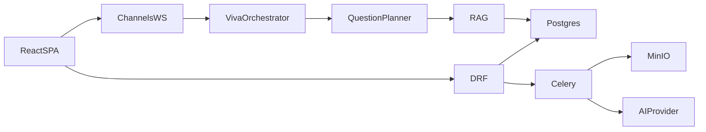

# Final Architecture Review — AI Viva

## Final architecture

AI Viva is a **modular monolith**:

- **Frontend:** React (Vite) + TypeScript + Tailwind + React Router SPA
- **Backend:** Django + DRF + Channels (Daphne)
- **Async:** Celery workers + Celery beat on Redis
- **Data:** PostgreSQL (pgvector image) + MinIO (S3 API)
- **AI:** Provider abstraction (`mock` default, OpenAI, Gemini)
- **Voice:** Browser Web Speech API (client STT/TTS); server STT/TTS interfaces stubbed
- **Observability:** Structured JSON logs, Prometheus metrics, Grafana provisioning

## Major components

| Component | Location |
|-----------|----------|
| Auth / JWT | `accounts/` |
| Tenancy | `common/tenancy.py`, middleware |
| Courses / assignments / rubrics | `courses/`, `assignments/`, `rubrics/` |
| Submission pipeline | `submissions/pipeline.py`, `adapters/` |
| RAG / knowledge | `rag/retrieval.py`, `rag/knowledge.py` |
| Question planning | `questions/planner.py` |
| Viva state machine | `viva/orchestrator.py`, `consumers.py` |
| Assessment HITL | `assessments/engine.py` |
| AI providers | `ai/providers/` |

## Design decisions & trade-offs

- **Mock-first AI** enables full local demos without API spend; live providers are env-activated.
- **JSON embeddings** on chunks keep tests SQLite-friendly; production uses Postgres/pgvector image.
- **Browser voice** avoids audio infrastructure cost; lower reliability than Whisper/TTS APIs.
- **Modular monolith** over microservices for portfolio clarity and local Docker simplicity.

## Limitations & technical debt

- True pgvector `VectorField` index not enforced in ORM layer yet (cosine over stored vectors).
- Google OAuth is a configured stub until client credentials exist.
- Email verification/reset uses console email backend.
- OCR for scanned PDFs is minimal.
- GitHub analysis clones/reads text only — never executes student code.
- E2E Playwright suite not yet expanded beyond API/unit coverage.

## Scalability

Horizontal Celery workers, multiple ASGI workers, S3 instead of MinIO, Redis Cluster if needed, CDN for frontend static assets.

## Security considerations

RBAC, tenant headers, rate limits, audit logs, no arbitrary code execution, AI cannot finalize grades.

## AI limitations

Assessments are recommendations. Mock evaluation metrics are not production LLM quality. Always display instructor-review disclaimer.

## Evaluation results

From `scripts/eval/results.json` (mock provider):

- 3 synthetic cases
- failure_rate: 0.0
- estimated_cost_usd: 0.0

## Future improvements

See `docs/roadmap.md` (LMS integrations, sandbox code execution, self-hosted LLMs, richer analytics).
