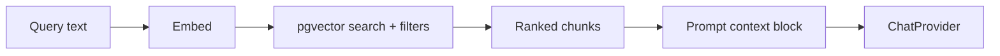

# RAG (Retrieval-Augmented Generation)

## Corpus

- Student `SubmissionChunk` (primary)
- Assignment instructions and rubric text
- Learning outcomes
- Optional `KnowledgeNode` entries

## Retrieval

1. Build query embedding via `EmbeddingProvider`
2. SQL similarity search on pgvector with filters:
   - `organization_id` (tenant)
   - `submission_id` (no cross-student leakage)
   - Optional: `file_type`, section metadata
3. Return top-k chunks with `source_ref` for citations

## Citations

Each evidence item should map to chunk `source_ref` (page, slide, file path). If retrieval returns nothing relevant, downstream prompts must allow “insufficient evidence” responses.

## Logging

`RetrievalLog` records query, filters, and hit ids for debugging and AI evaluation.

## Configuration

- `EMBEDDING_DIMENSIONS` (default 1536)
- Provider via `AI_PROVIDER` / embedding model env vars

## Related

- [ADR-009](adr/ADR-009-rag-architecture.md)
- [submission-processing.md](submission-processing.md)
