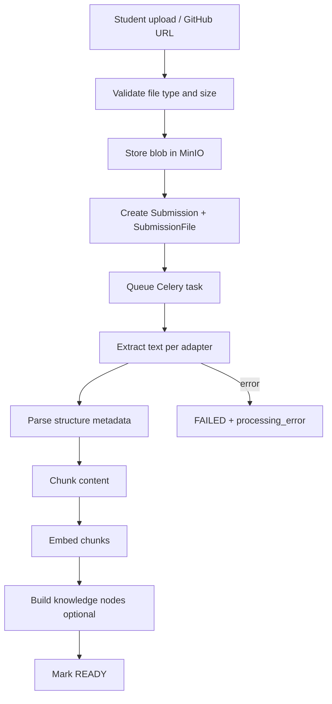

# Submission Processing

Asynchronous pipeline from upload to `Submission.status = ready`.

## Flow

## Adapters (MVP)

| Type | Adapter responsibility |
|------|------------------------|
| PDF | Text, page numbers, headings where possible |
| DOCX | Paragraphs, headings, tables |
| PPTX | Slide text, slide index, notes |
| GitHub URL | README, tree, selected files via API (no code execution) |
| ZIP | Extract and delegate to inner adapters |

**Never execute** student code on app servers.

## Celery tasks

- Idempotent task keys per `submission_id` + version
- Retries with backoff on transient failures
- Timeouts aligned with `CELERY_TASK_TIME_LIMIT`

## Status model

`uploaded → queued → processing → ready | failed`

## Storage

- Binary: MinIO key on `SubmissionFile.storage_key`
- Text: `extracted_text`, `SubmissionChunk.content`
- Structure: JSON on file and chunk `metadata`

## Related

- [rag.md](rag.md) — embeddings
- [ADR-004](adr/ADR-004-redis-celery.md), [ADR-005](adr/ADR-005-object-storage-minio-s3.md)
