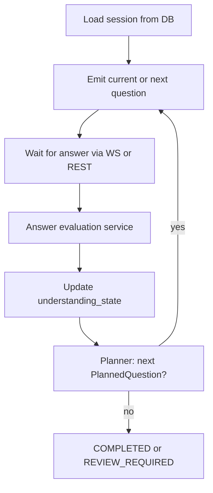

# Viva Orchestrator

Server-side coordinator for live viva sessions ([ADR-006](adr/ADR-006-stateful-viva-orchestration.md)).

## State machine

States on `VivaSession.state`:

| State | Meaning |
|-------|---------|
| CREATED | Session record exists |
| PREPARING | Loading plan / RAG context |
| READY | Student may start |
| IN_PROGRESS | Active Q&A |
| PAUSED | Temporarily suspended |
| COMPLETED | Normal end |
| REVIEW_REQUIRED | Needs instructor attention before close |
| FAILED | Unrecoverable error |

## Per-turn loop

## WebSocket (Channels)

- Consumer validates JWT and session ownership
- Events: `session.state`, `question.new`, `answer.accepted`, `processing`, `error`
- Client messages: `answer.submit`, `session.pause`, `session.resume`

Reconnect: client resyncs via REST session detail + latest question id.

## Modes

- `text`: answer body in JSON
- `voice`: transcript from browser STT (`input_mode` on `StudentAnswer`); optional future audio key in MinIO

## Related

- [ADR-010](adr/ADR-010-websocket-real-time-communication.md)
- [voice.md](voice.md)
