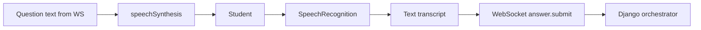

# Voice Interface

MVP voice viva uses the **browser Web Speech API**, not server-side STT/TTS.

## Architecture

Backend treats voice answers like text once transcribed. `StudentAnswer.input_mode = voice`.

## Backend stubs

`STTProvider` / `TTSProvider` interfaces in `ai.providers` are **unused in MVP** but allow future Whisper or cloud voice without orchestrator changes.

Optional `audio_storage_key` on `StudentAnswer` for future server-side audio retention.

## UX requirements (Phase 9)

- Recording indicator and mic permission handling
- Fallback to text mode on STT failure or unsupported browser
- WebSocket reconnection without losing session id
- Timer and connection status visible

## Browser support

Document known limitations (Safari, mobile) in instructor assignment settings. Require secure context (HTTPS or localhost) for mic access.

## Related

- [viva-orchestrator.md](viva-orchestrator.md)
- [ADR-010](adr/ADR-010-websocket-real-time-communication.md)
